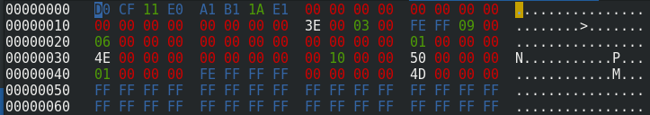

Overview
=================

Microsoft .doc files are of the older type of wordprocessing files and are binary files. This means we can't view the source data directly in a text editor, but have to view them through a program called a *Hex Editor*.

In the Hex Editor they'll be displayed as hexadecimal characters that denote the binary. Here's the *Header*, the first few lines of "coordinated-shared-passwords.doc" from the Guccifer2.0. Archive:

These files work a lot like computers work. The header in a WORD document is analigous to the master boot record of a hard disk. It tells the computer what the sector sizes are, and where to look for the first record. Just as a computer hard disk may say:

"Hey dumbo. You'll probably want to find the boot loading system. Well it's at this location, and is this size".

When dumbo get's there he'll find another note that says:

"Christ you haven't even found the drivers for the screen and USB ports! They're here, and this size"

And the next note will tell it where all the other essential parts are, which will pass it along, and along, giving locations and sizes of stuff, until finally it finishes with what everyone is interested in; the files themselves

A WORD doc works the same way. Note that the first few characters "D0 CF 11 E0  A1 B1 1A E1" are what's known as the *Magic* characters that tell the computer it's a Microsoft word document. All file headers have this *magic* that denote the file type.

The Header
===============

This header is what's known as a compound file header, the principals work the same way for all binary format microsoft documents like .xls, and .ppt. It also tells us some other important detail about the program version that made the file.

A byte is seldom wasted in a binary file. Even the 32 zeros (equal to 16 bytes, a byte is two characters) that follow the magic have a meaning. This is the Class Identifier (CLSID) of the header. This is always zero for a header, but in other cases denotes a unique reference for an operation. Bear this in mind - it becomes useful later.

After that on the second line, denoted 00000010 (not actually 10, but 16, as we are in hexadecimal) half way along we find "3E 00 03 00" which are the minor and major versions of WORD that made the file.

Why minor and major, and not major, then minor?

For that a short diversion is required. 

Little Endian Vs Big Endian
===========================

When a number is written like 133, it's written, by sane people, with the big numbers first. One hundred is bigger than 30, which is bigger than 3, so it's written:

one hundred and thirty and three = 133

Some programs do it that oh so logical way, but some, like Microsoft Binary files don't. They say it's easier on the computer's brain cells if you tell it:

There's a 3, and there's a 30, and there's a 100.

So it would prefer to read it as 331, not 133.

Back to Major & Minor
=====================

So while we may have "3E 00 03 00" denoting minor and major versions, the computer will **read** it as 00 03 (Major) 00 3E (Minor) as hex, or in decimal we have WORD Version 3.62

The little-endian nature of it all is confirmed by the next two bytes: "FE FF". This combination says to Dumbo, "Hey Buddy, I'm Little Endian - deal with it". If it were "FF FE" that would mean he's a Big Endian Bad Boy. None of the Guccifer binary files are Bad Boys.

Sector Size
==============

These files are broken down into chunks of a certain size. Time and again the file will tell Dumbo to go a certain number of chunks onwards to find the information it's looking for. But it's no good telling Dumbo to go look 37 chunks ahead if the file doesn't tell him how big a chunk is.

Microsoft calls a chunk a *sector*. I think chunk is catchier, but *sector* it is.

The two bytes after the "FE FF" give the sector size. Rather than just telling us what it is, it gives a number which has to be looked up. It's no biggie really because if the Major version is 3 or 4, i.e. an old version of WORD, then the sector size will be 200 hex.

In Decimal 200 Hex is 512 bytes (= 512 x 2 characters of hex = 1024 characters). All our documents are 512 bytes, which is convenient. For once.

=============
Line 00000020
=============

This line tells us three things:

1) Mini Sectors
==================

Not all information needs 512 Bytes. Some will fit in 64 Bytes, so the next four bytes tell us that.

Starting line 00000020 (in hex = 32 in decimal) we find "06 00 00 00". All our .doc files are "06 00 00 00", which means they all have a Mini Sector size of 64 Bytes

2) Four Zero Bytes: Number of Directory Sectors
======================================================

Next up we have some padding - six zero bytes - then an integer giving the number of Directory Sectors.

In a Major Version 3 file this is always four zero bytes. As all of ours are Version 3, it doesn't effect us.

3) Number of FAT (File Access Table) Entries
============================================
The File Access Table (FAT) contains the cogs of the file 
In our example we have only one "01 00 00 00".
=======
Line 30
=======

This crucial line contains the first location that interests us. And it interests us alot. And three other things.

1) First Directory Sector Location
==================================
This is the primary place where we'll find the locations of all that lovely metadata: Timestamps, Author names, Company names, language settings, locale settings and much more besides.

These are stored as various entries in a Directory Sector Array (DSA). They're things like the Root Entry, document Summary Information, Summary Information, and according to whether or not it's a .doc, or .xls, things like the location of the word data, or spreadsheet data. There's also plenty of other goodies here.

But sometimes there's more than one Directory Sector - which one has the correct Metadata? Viewing the properties of a document will tell you some of it, but maybe not all the data in the second, third (4th...) DSA.

This is the reason **why** the data has to be parsed from scratch to catch all of it. Maybe the document was overwritten, the old Metadata could be in the second location. Some documents have *orphaned* DSAs. They're still there, but not referenced by anything. In a normal document they are chained; i.e. if there's more than one the location of the second is referenced in the first. But on occasion they aren't "chained". We have to dig around for them. 

In our example the first 4 bytes "4E 00 00 00" is the location of the first DSA. As we know it's little ended this is 4E in hex. The file is telling Dumbo to just bloody well go and look at the "4E"th sector to find the first DSA location. But as the header is also a sector we have to subtract that, so it's really 4E minus one sectors on. Thus by the magic of maths we can find the first DSA location:

Sector Number x Sector Size = Location in Bytes
(4E - 01) x 200 = 4D x 200 = 9A00 Bytes

So our first Directory Sector Location is at position 9A00 Bytes in Hex (or 39,424 Bytes in Decimal).

Is it there? Sneak peak.
.. image:: DSA.png

Yep, it's correct. But let's get the header finished up with first. There's more clues to find...

=======
Line 40
=======

